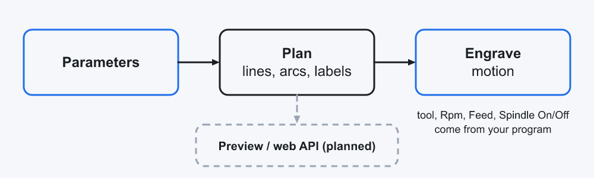
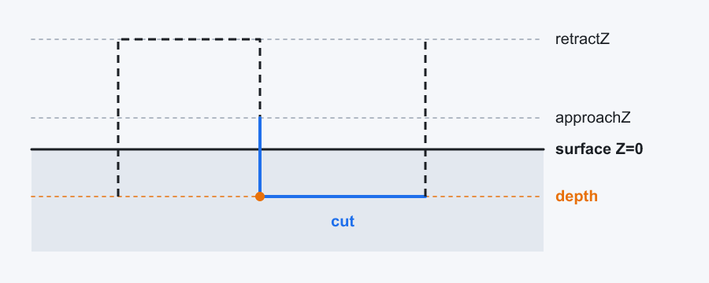

# ScaleEngraver - developer documentation

Not part of the package (the package only contains `Library/`, `Samples/` and `Tests/`, see
`metadata.json`). The end-user documentation is `README.md`, the store page `Installer/store/description.md`.

**Shape:** pure simPL, no C# service. Two library modules: `ScaleEngraver` is the public surface with two commands,
`ScaleEngraverCore` is the engine (parameter structures, geometry as data). Users only see the commands.

## Layout

| Path | Content |
|------|---------|
| `Library/ScaleEngraver/ScaleEngraver.simpl` | the public commands `EngraveRuler` and `EngraveDial`: defaults, units, kinds |
| `Library/ScaleEngraver/ScaleEngraverCore.simpl` | the engine: parameter structures, planning layer (geometry as data), engraving layer |
| `Library/ScaleEngraver/images/` | parameter icons used in the `@doc` texts (`README.md` there lists them) |
| `Samples/ScaleEngraver/` | the dialog app and the commented samples |
| `Tests/ScaleEngraver/ScaleEngraverTest.simpl` | checks of the core's planning layer (no machine motion) |
| `Installer/store/` | store listing: `description.md`, `logo.png` (= `Store.Image`, the tile logo) |
| `docs/` | README graphics, `docs/tiles/` (tile-style icons and the app logo, `gen_tiles.py`), `gen_graphics.py` and `render.ps1` to regenerate them |
| `.agents/`, `.claude/`, `AGENTS.md`, `CLAUDE.md` | simPL skill, deployed by `simpl-skill install` |

## Architecture

* **Commands** (module `ScaleEngraver`): `EngraveRuler` and `EngraveDial` take position and size and
  fill every other setting from defaults, then call the core. There is no plan to hand around and no
  executor to call: one command, one scale.
* **Defaults** are defined once in millimetres and divided by the millimetres per unit of the control
  (`AxisSystem::MeasuringSystem`: 1 or 25.4), so the same call works on a metric and on an inch control:
  tick 6 mm, factor 0.7, depth 0.1 mm, number height = half the tick (at least 2.5 mm), feed height 1 mm. The dial tick is 20 percent of the radius (at most 6 mm).
* **Tick lengths:** one length (the longest tick) and one factor. Level L is `tickLength x factor^L`:
  millimetre/centimetre ruler levels 0-2 (10 / 5 / 1 mm), inch ruler levels 0-`levels` (1, 1/2, 1/4 ...).
* **Kinds** (`ScaleKind`, `DialKind`) bundle range, steps, sweep, side and number orientation; every
  value can be overridden.
* **Core** (module `ScaleEngraverCore`): parameter structures, `Plan...Scale` returns a `ScalePlan`
  (lines, arcs, labels as data), `EngraveScalePlan` turns it into motion. Pure motion: the **calling
  program** selects the tool and sets `Rpm`, `SafeZHeightForWorkpiece`, `SetFeedTechnology plunge= finishing=`; `EngraveRuler`/`EngraveDial`/`EngraveAngleScale` run their motion inside `MillingCyclesUtilities::ExecuteMillingCycle`, which handles the spindle (and the machine state), so the samples have no `Spindle On/Off`. The plan layer is kept for
  the tests and for a later preview / web API; it is not part of the user surface.
### Move sequence

For every tick, baseline and arc: `PrePositioning X Y Z` (the control moves up to the `SafeZHeightForWorkpiece`, over the start and
down to `Z + feedHeight`), plunge feed to `Z - depth` (`Feed technology=Plunge`, in cuts of `infeedZ`; the cuts alternate in
direction), finishing feed along the line (`Feed technology=Finishing`). No connecting move at the surface. The last element
ends with `PrePositioning Z=SafeZHeightForWorkpiece`.

Text is engraved with `StandardTextEngrave`. It counts from the position it starts at and treats that position as the rapid
level (`strokeRapidZ`) above the surface, so a label is positioned at `Z + strokeRapidZ` first (observed: starting at `Z` = 10 the
text ended 2.1 mm deep instead of 0.1, exactly `strokeRapidZ` too deep). `strokeRapidZ` is twice the feed height. The command takes a
positive `depth`, and `strokeCuttingZ` counts like the depth (final cut at `-(strokeCuttingZ + depth)` below the surface), so the library
passes `strokeCuttingZ = -feedHeight` and `depth = textDepth + feedHeight`. `StandardTextEngrave` has no `infeedZ`, so a text deeper than `infeedZ` is engraved several times, each pass starting `feedHeight` above the bottom of the previous one (`strokeCuttingZ = previousDepth - feedHeight`, `depth = step + feedHeight`).

## Parameters (core structures)

All lengths in mm, angles in degrees (0 = +X, counter-clockwise). Depths are **positive numbers =
how deep below the surface** (measured from `Z`, the height of the surface); the library converts them (`Z - depth`).
Every structure has a `New...` constructor with defaults for optional values; the `@doc` texts
describe every parameter.

| Structure | Fields |
|-----------|--------|
| `ScaleDivision` | `valueStart`, `valueEnd`, `majorStep`, `minorDivisions`, `mediumEvery`, `skipFirstTick`, `skipLastTick` |
| `TickStyle` (major, medium, minor) | `tickLength`, `tickDepth` |
| `LabelSettings` | `labelHeight`, `labelWidth`, `labelDepth`, `labelOffset`, `decimals`, `labelEvery`, `skipFirstLabel`, `skipLastLabel`, `fractionDenominator` (0 = decimals) |
| `LinearScale` | `originX/Y`, `scaleLength`, `rotationAngle`, `side`, `majorTick`, `minorTick`, `mediumTick`, `labelFormat`, `baselineDepth` |
| `CircularScale` | `centerX/Y`, `radius`, `startAngle`, `endAngle`, `side`, `majorTick`, `minorTick`, `mediumTick`, `labelFormat`, `orientation`, `baselineDepth` |
| `FractionScale` (inch ruler) | `originX/Y`, `scaleLength`, `rotationAngle`, `valueStart`, `valueEnd`, `levels` (halvings), `tickStyles` (one per level), `unitLabel`, `fractionLabel`, `fractionLabelLevel`, `side`, `skipFirstTick`, `skipLastTick`, `baselineDepth` |
| `EngraveHeights` | `referenceZ`, `feedHeight`, `infeedZ` |

## Development

* Link the repo to the control once: `simpl-pkg install --dev` (needs Windows Developer Mode).
* After changing a **signature** of the library (a parameter, a structure) the control must reload
  the user library folder (`POST /api/Execution/RefreshUserDefinedLibraryFolder`, by the operator)
  before dependent modules compile; then `refresh_simpl_catalog`. A changed program body is picked
  up through the links.
* Compile: `simpl-mcp check <file>`. The tests can be run in the isolated simulation.
* Regenerate graphics: `docs\render.ps1` (Python and `resvg`); icons: `Library\ScaleEngraver\images\render.ps1`.

## Status

* Compiled against a control; the planning and engraving programs, the tests and the samples ran in
  the simulation. On the control's simulation screen the ticks and the text engrave at the right
  depth with the move sequence above.
* **Not yet run on a real machine** - first run on scrap material.
* The text placement relies on `StandardTextEngrave`: vertically centred on the programmed point,
  aligned horizontally by the label's alignment, rotation in degrees counter-clockwise.
* `Horizontal` labels on a circle estimate the text width from `labelWidth` x number of characters.

## Next steps (not implemented)

* Web API (C# service, OpenAPI 3, generated simPL client - see
  `.agents/skills/simpl/references/external-services.md`) that takes the parameter structures and
  returns the `ScalePlan` as JSON / SVG for a preview and parametrisation.
* Non-uniform scales (logarithmic), inscriptions on a circle.

## Inch

* `AxisSystem::ImperialMeasuring` / `AxisSystem::MetricMeasuring` switch the whole control; the library only uses plain numbers, so an inch program needs no conversion (see `SampleInchRuler`, verified in the editor simulation: 3230 positions).
* **The library module must not declare a measuring system** (no `@ MeasuringSystem = ... @` in its header). With `Metric` in the library header, calling it from an inch program (or after `ImperialMeasuring`) faulted at the first call in the isolated simulator.
* `FractionScale` (`NewFractionScale`, `PlanFractionScale`, `EngraveFractionScale`) is the inch ruler: the unit is halved `levels` times, level = number of halvings needed to reach a tick (whole units 0, halves 1 ...), one `TickStyle` per level, unit numbers from `unitLabel`, fractions (fractional part only, via `FractionText`) from `fractionLabel` down to `fractionLabelLevel`.
* Fraction labels: `FractionText` rounds to the nearest 1/denominator, reduces with gcd and writes mixed numbers (tested: 1/8, 1/4, 3/8, 1/2, 1 1/2, 2 13/16, 3/10, -3/4).

## Angle scale (speed square)

`EngraveAngleScale` takes the pivot and the scale line (start point plus end point, or length and direction). It computes
the foot of the perpendicular from the pivot (`alongPivot`), the distance (`|acrossPivot|`) and the true angles at the
start and the end (`atan`). It then uses a normal `LinearScale` with `angleDistance` = distance and
`angleOffset` = true start angle - `angleStart`: the value v sits at `distance * (tan(v + offset) - tan(valueStart + offset))`
from the origin, and the tick direction is rotated by the true angle so that every tick points to the pivot. The ticks are
placed on whole degrees of the value, so the numbers start at the start point with `angleStart` (default 0). The side of the
ticks follows the side of the pivot.

## Leaving out numbers and ticks

`skipFirst`/`skipLast` of the commands are label counts (`LabelSettings.skipFirstLabel/skipLastLabel`): the plans build all
labels and `TrimLabels` drops the first / last n in scale order (for the inch ruler the fractions count, too); the ticks stay.
`skipFirstTicks`/`skipLastTicks` are tick counts (`ScaleDivision.skipFirstTick/skipLastTick`): every tick counts, the labels
of removed ticks disappear with them. `numbers=false` is a label skip of 1000000.

## Editor quirks

The control's editor rejects some sources that `check_simpl_source` accepts (the simulation refuses to start with
"Load a program without errors"): a program call nested in a parameter (`division=NewScaleDivision(...)`) and, it seems,
`sizeof a.b == n` inside a condition. Use a variable first. An editor tab with an old unsaved version of a file also blocks
loading the new one - close it without saving.
