# Icons

Parameter icons (64 px) and the header images of the commands (360 px), generated from the SVGs.

| Icon | File | Used for |
|---|---|---|
| 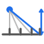 | angleDistance.png / .svg | PivotX |
| 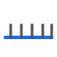 | baselineDepth.png / .svg | baseline, baselineDepth |
| 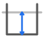 | depth.png / .svg | arcDepth, depth, labelDepth, lineDepth, textDepth |
| 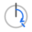 | endAngle.png / .svg | endAngle |
| 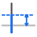 | feedHeight.png / .svg | feedHeight |
| 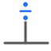 | fractionDenominator.png / .svg | fractionDenominator |
| 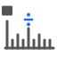 | fractionLabel.png / .svg | fractionLabel |
| 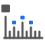 | fractionLabelLevel.png / .svg | fractionLabelLevel, fractionLevel |
| 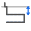 | infeedZ.png / .svg | infeedZ |
| 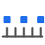 | labelEvery.png / .svg | labelEvery |
| 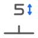 | labelHeight.png / .svg | labelHeight |
| 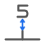 | labelOffset.png / .svg | labelOffset |
| 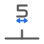 | labelWidth.png / .svg | labelWidth |
| 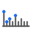 | levels.png / .svg | levels |
| 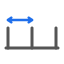 | majorStep.png / .svg | majorStep |
| 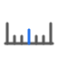 | mediumEvery.png / .svg | mediumEvery |
| 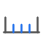 | minorDivisions.png / .svg | minorDivisions |
| 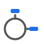 | orientation_horizontal.png / .svg | orientation |
| 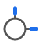 | orientation_radial.png / .svg | orientation |
| 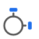 | orientation_tangential.png / .svg | orientation |
|  | radius.png / .svg | radius |
| 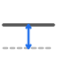 | referenceZ.png / .svg | referenceZ, Z |
| 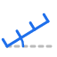 | rotationAngle.png / .svg | angle, rotationAngle |
| 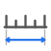 | scaleLength.png / .svg | length, scaleLength |
| 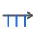 | side_negative.png / .svg | below, inside, side |
| 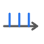 | side_positive.png / .svg | side |
| 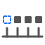 | skipFirstLabel.png / .svg | skipFirst, skipFirstLabel |
| 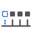 | skipFirstTick.png / .svg | skipFirstTick, skipFirstTicks |
| 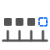 | skipLastLabel.png / .svg | skipLast, skipLastLabel |
| 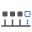 | skipLastTick.png / .svg | skipLastTick, skipLastTicks |
|  | startAngle.png / .svg | angleStart, startAngle |
| 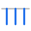 | tickDepth.png / .svg | tickDepth |
| 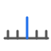 | tickLength.png / .svg | tickLength |
| 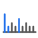 | tickStyles.png / .svg | factor, tickStyles |
|  | unitLabel.png / .svg | unitLabel |
|  | header_EngraveAngleScale.png / .svg | EngraveAngleScale |
|  | header_EngraveDial.png / .svg | EngraveDial |
| 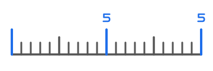 | header_EngraveRuler.png / .svg | EngraveRuler |

Regenerate: `render.ps1` (runs `gen_icons.py` and `gen_headers.py`, then resvg: 64 px icons, 360 px headers).
