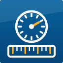
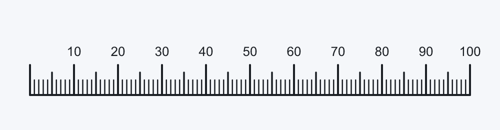
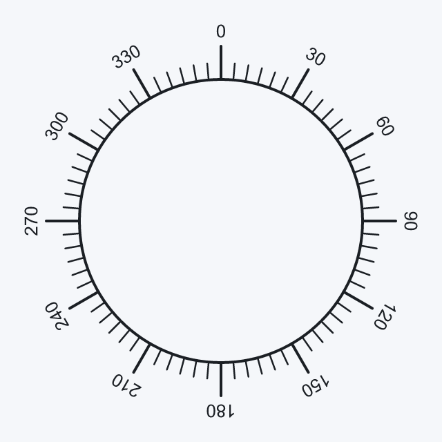
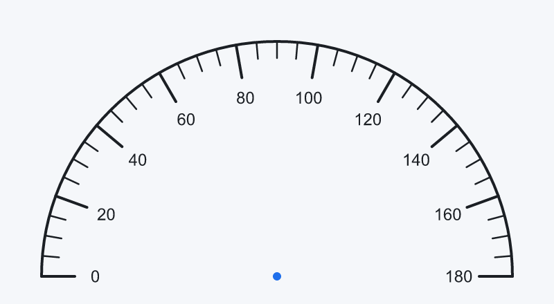

# Scale Engraver

Engrave **rulers, dials, gauges and protractors** on your part. You describe the scale - what it
shows, where it sits, how long the ticks are - and Scale Engraver engraves every tick and number.

## What you can do

- Straight scales in any direction, with the ticks on either side of the line
- Circular scales: a full dial, a gauge with a partial sweep, a protractor - clockwise or counter-clockwise
- Three tick classes - **major**, **medium**, **minor** - each with its own length and depth
- Numbers beside the major ticks: size, decimals, distance to the tick, every n-th number only
- A real inch ruler: whole inches, halves, quarters, eighths, sixteenths - every level with its own tick length, big numbers for the inches and small fractions (1/2, 1/4, 3/4) beside the longer ticks
- Numbers written as fractions (1/8, 1/4, 3/8, 1 1/2 ...) on any scale - or with any other denominator
- Leave out the first or last tick, or only its number - for example where the scale ends on the edge of the part
- Numbers on circular scales that follow the circle, run along the radius or stay horizontal
- Engrave the scale line or arc itself

| | |
|---|---|
|  |  |

## How to use it

Start the sample **ScaleEngraverApp** and answer the dialogs:

1. Scale type - straight or circular
2. Tool, spindle speed, feed and heights
3. Values: first and last value, a major tick every n, minor ticks in between, medium ticks
4. Tick lengths and depths, number size, position and size of the scale

The scale is then engraved. The coordinate system must have Z = 0 on the surface of the part.

To engrave a scale from your own program, copy the sample that is closest to what you need.
Every sample is commented step by step.

## Samples

| Sample | Engraves |
|--------|----------|
| `ScaleEngraverApp` | any scale, asks for everything in dialogs |
| `ScaleEngraverSample` | a 100 mm ruler and a dial segment - the smallest example |
| `SampleInchRuler` | a real 6 inch ruler programmed completely in inch: five tick levels (inch to 1/16), big numbers and small fractions |
| `SampleProtractor` | a half circle 0 to 180 degrees, ticks and numbers inside |
| `SampleGauge` | a 270 degree gauge 0 to 100 with a marked "red zone" |
| `SampleEdgeRuler` | a vertical ruler along a part edge; the tick on the edge is left out |
| `SampleDialVariants` | three dials side by side: numbers following the circle, along the radius, horizontal |
| `SamplePlanOnly` | shows what will be engraved, asks, changes it and engraves |

## The settings

All lengths in mm, angles in degrees (0 = right, counter-clockwise). **Depths are positive
numbers: how deep the engraving goes below the surface**, for example 0.2.

| Setting | Meaning |
|---------|---------|
| First / last value | what the scale shows, for example 0 to 100 or 0 to 360 |
| Major tick every | value step between two major ticks |
| Minor ticks per major | how many small intervals lie between two major ticks (10 gives nine minor ticks) |
| Medium tick every | every n-th minor interval gets a medium tick, for example 5 for a tick halfway between two major ticks; 0 = none |
| Tick length / depth | separately for major, medium and minor ticks |
| Skip first / last tick | leaves out the tick **and** its number |
| Number size, width, depth | size of the engraved numbers |
| Distance number to tick | gap between the end of the major tick and the number |
| Decimals | decimal places of the numbers |
| Fractions | 0 = decimal numbers; 2, 4, 8, 16 write the numbers as halves, quarters, eighths, sixteenths (1/8, 1/4, 3/8, 1 1/2 ...), 10 as tenths |
| Number every | 1 = every major tick gets a number, 2 = every second one, ... |
| Skip first / last number | leaves out only the number |
| Scale length, direction | straight scale: how long, and the angle (0 = to the right, 90 = upwards) |
| Side | which side of the line (or inside / outside of the circle) ticks and numbers are engraved |
| Centre, radius, start / end angle | circular scale; an end angle smaller than the start angle runs clockwise |
| Number orientation | circular scale: following the circle, along the radius, or horizontal |
| Line depth | depth of the scale line or arc itself; 0 = not engraved |
| Retract height | height of the moves between two engravings |
| Approach height | height just above the surface where the feed move into the material starts |
| Safe height | height after the last engraving |

Inch ruler (fraction scale)

| Setting | Meaning |
|---------|---------|
| Levels | how often the inch is halved: 4 = down to sixteenths, 5 = thirty-seconds |
| Longest tick length / depth | the whole inches; every finer level gets a shorter and shallower tick |
| Inch numbers | size and position of the numbers 1, 2, 3 ... |
| Fraction numbers | size of the fractions (1/2, 1/4, 3/4); by default 60 percent of the inch numbers |
| Fractions down to | 0 = none, 1 = halves, 2 = also quarters, 3 = also eighths |

Good to know

- Numbers sit beyond the end of the major tick. Where tick classes coincide, the stronger one is engraved
  (major before medium before minor), never two.
- A full 360 degree scale engraves the tick at the start only once.
- Use a tool whose maximum spindle speed is defined; set speed and feed to suit your tool and material.
- The numbers are engraved with the control's single-stroke text engraving.
- Run the first part on scrap material.
