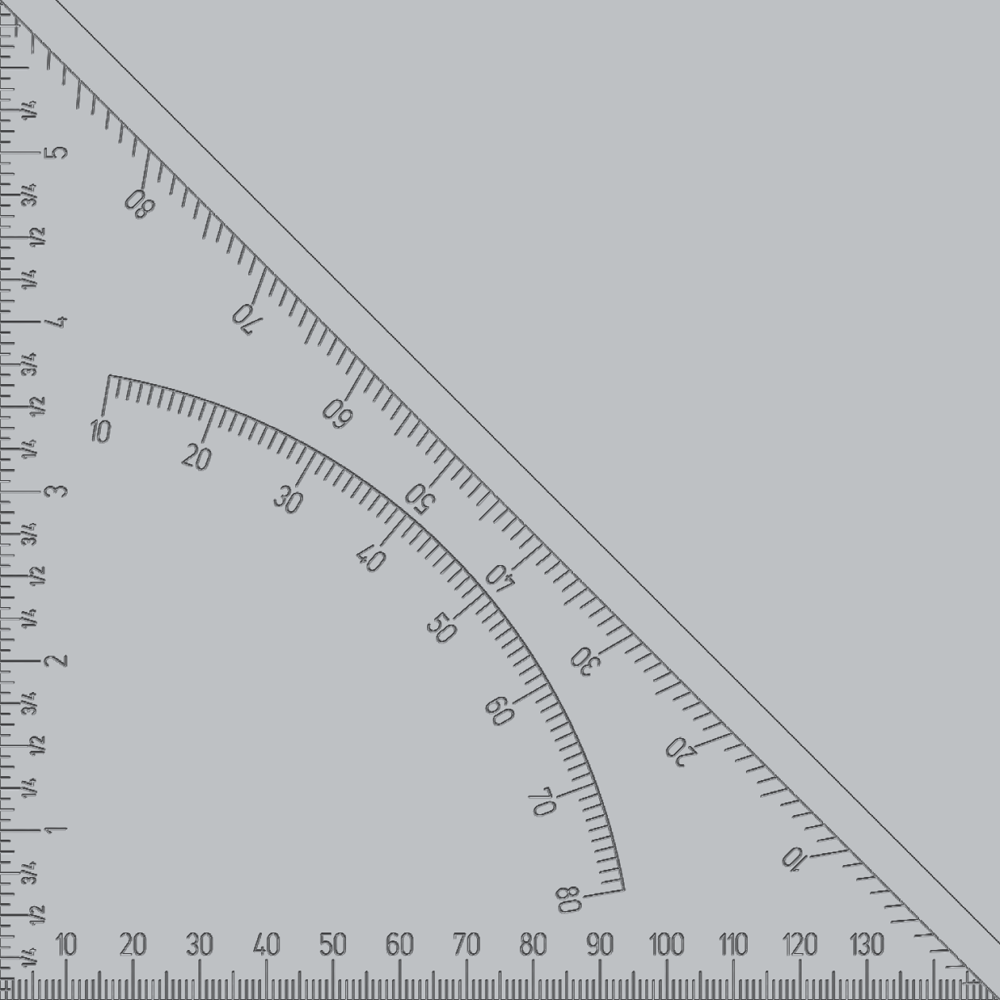
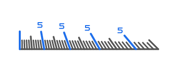

# Scale Engraver

Engrave **rulers, dials and angle scales** on your part with **one command each**. You say where the scale goes and how
big it is - the ticks, the numbers, the depth and the heights come from sensible defaults.

```
EngraveRuler X=10 Y=10 Z=0 length=100
EngraveDial  X=60 Y=60 Z=0 radius=28
EngraveAngleScale X=150 Y=0 Z=0 EndX=0 EndY=150 PivotX=0 PivotY=0
```


## Example: a speed square - several scales on one part



Every command engraves one scale, so a part with several scales is simply several lines in one program. The sample
`SampleSpeedSquare` engraves four scales on a 150 mm square plate and then mills the 45 degree edge (the picture is the
simulated part, seen from above):

```
size = 150
EngraveAngleScale X=size Y=0 Z=0 EndX=0 EndY=size PivotX=0 PivotY=0 skipFirst=1 skipLast=1 depth=0.8
EngraveRuler X=0 Y=0 Z=0 length=size skipFirst=1 skipLast=2 depth=0.8
EngraveRuler X=0 Y=0 Z=0 length=size angle=90 kind=ScaleKind.Inch below=true skipFirst=1 skipLast=2 depth=0.8
EngraveDial  X=0 Y=0 Z=0 radius=size * 95 / 150 startAngle=80 endAngle=10 valueStart=10 valueEnd=80 inside=true depth=0.8
```

- **One coordinate system for all scales.** The corner of the square is (0, 0); every scale is placed relative to it.
- **The angle scale** runs along the 45 degree edge. Its pivot is the corner, so every tick points to the corner and the
  numbers count 0 to 90 degrees.
- **Two rulers** share the corner: millimetres along the bottom edge, inches along the left edge (`angle=90` turns the
  ruler upwards, `below=true` puts the ticks on the inside).
- **The dial** is a protractor arc around the same corner, from 10 to 80 degrees, ticks inside.
- **Clean corners.** `skipFirst` and `skipLast` leave out the numbers that would collide in the corners; the ticks stay.
- **One size.** `size` sets the plate; all scales follow it.
- **Engrave, then mill.** After the engraving the program changes to a 6 mm end mill and cuts the 45 degree edge through
  the plate: tool radius compensation, approach and leave moves outside the plate, several infeeds. Engraving and milling
  run in one program with two tools.

## The commands

**EngraveRuler** - a straight scale

| Setting | Meaning | Default |
|---------|---------|---------|
| `X`, `Y`, `Z`, `length` | where the ruler starts (Z = height of the surface) and how long it is | required |
| `kind` | `Millimeter`, `Centimeter` (numbers in cm) or `Inch` (halves, quarters ... sixteenths) | Millimeter; Inch on an inch control |
| `valueStart`, `valueEnd` | your own scale: the values at the start and at the end of the ruler, e.g. 20 to 70 or -50 to 50 | 0 to the length |
| `majorStep` | value distance between two numbered ticks | 10 (mm), 1 (cm, inch); automatic for your own range |
| `angle` | direction: 0 = to the right, 90 = upwards | 0 |
| `below` | ticks and numbers on the other side of the line | false |
| `skipFirst`, `skipLast` | number of **numbers** to leave out at the start / end; the ticks stay | 0 |
| `skipFirstTicks`, `skipLastTicks` | number of **ticks** to leave out at the start / end, together with their numbers (e.g. 1 at a part edge) | 0 |
| `numbers` | false = ticks only | true |
| `levels`, `fractionLevel` | inch ruler: halve down to 1/16 (4) or 1/32 (5); fractions get numbers down to quarters (2) | 4, 2 |

**EngraveDial** - a circular scale

| Setting | Meaning | Default |
|---------|---------|---------|
| `X`, `Y`, `Z`, `radius` | centre (Z = height of the surface) and radius of the scale circle | required |
| `kind` | `Degrees` (0-360), `Percent` (0-100), `Gauge` (0-100 over 270 degrees), `Protractor` (0-180, inside) | Degrees |
| `valueStart`, `valueEnd` | your own scale: the values at the start and at the end angle, e.g. a gauge from 20 to 80 | 0 to the kind's end |
| `majorStep` | distance between long ticks | from the kind; automatic for your own range |
| `startAngle`, `endAngle` | where the scale starts and ends (0 = right, 90 = 12 o'clock, smaller end angle = clockwise) | from the kind |
| `inside`, `orientation` | ticks inside the circle; numbers `Tangential`, `Radial` or `Horizontal` | from the kind |
| `skipFirst`, `skipLast`, `skipFirstTicks`, `skipLastTicks`, `numbers` | as for the ruler | 0, 0, 0, 0, true |

**EngraveAngleScale** - an angle scale on a straight edge, like a speed square



| Setting | Meaning | Default |
|---------|---------|---------|
| `X`, `Y`, `Z` | start of the scale line (Z = height of the surface) | required |
| `PivotX`, `PivotY` | the pivot, the corner of the square the angles are measured from (nothing is engraved there) | required |
| `EndX`, `EndY` | end of the scale line | |
| `length`, `angle` | instead of the end point: length and direction of the line (0 = to the right, 90 = upwards) | angle 0 |
| `angleStart` | the angle value at the start point; the numbers count from there | 0 |
| `majorStep` | angle between two numbered ticks | 10 |
| `skipFirst`, `skipLast`, `skipFirstTicks`, `skipLastTicks`, `numbers` | as for the ruler | 0, 0, 0, 0, true |

Give the end point **or** the length. The ticks are placed by the angle as seen from the pivot, so they get farther apart the farther they are from the foot of the perpendicular (`distance * tan`). The numbers start at the start point with 0 (or with `angleStart`) and count the angle swept as seen from the pivot. The ticks are radial: each one points to the pivot, so they lean more the farther they are from the foot. There is a tick every degree and a longer one every 5 degrees.

All commands also take the settings below.

| Setting | Meaning | Default |
|---------|---------|---------|
| `tickLength` | length of the **longest** tick | 6 mm (dial: 20 % of the radius, at most 6 mm) |
| `factor` | every finer tick level is this much as long as the level before | 0.7 |
| `labelHeight` | height of the numbers | half the tick length, at least 2.5 mm |
| `baseline` | also engrave the line along the ticks | true |
| `depth` | engraving depth, measured from `Z` | 0.1 mm |
| `feedHeight` | height above `Z` where the movement starts with the plunge feed | 1 mm |
| `infeedZ` | maximum depth per cut; the depth divided by it gives the number of cuts, which alternate in direction without lifting | the depth (one cut) |

The defaults are given in millimetres and are converted by themselves when the control is set to inch.
Select the tool and set `Rpm` in your program before the command, plus the retract height and the feeds like for the DATRON cycles. The command itself takes care of the spindle (it runs as a milling cycle):

```
SafeZHeightForWorkpiece = 15
SetFeedTechnology plunge=200 finishing=800
```

`Z` is the height of the surface; every depth is measured from it. Every engraving starts with `PrePositioning`: the tool moves up to the safe height set with `SafeZHeightForWorkpiece`, over the start and down to the feed height. `plunge` is the feed for the move into the material, `finishing` the feed for the cut along every tick, line and arc.

## One length and one factor

You define **one** tick length - the longest tick - and every finer level is a fixed fraction of the one before.
With the default factor 0.7:

| Level | Millimetre ruler | Inch ruler | Length |
|-------|------------------|------------|--------|
| 0 | every 10 mm (with number) | every inch (big number) | 100 % = `tickLength` |
| 1 | every 5 mm | 1/2 inch (small number) | 70 % |
| 2 | every 1 mm | 1/4 inch (small number) | 49 % |
| 3 | | 1/8 inch | 34 % |
| 4 | | 1/16 inch | 24 % |

Change the `tickLength` and the whole ruler scales with it; change the `factor` (for example 0.6) for a stronger
step between the levels. The numbers follow the tick length, too.


## Samples

Every sample is only a few lines and commented; copy the one that is closest to your part.

| Sample | Engraves |
|--------|----------|
| `ScaleEngraverApp` | any scale, asks for everything in two dialogs |
| `ScaleEngraverSample` | a 100 mm ruler and a dial - the smallest example |
| `SampleInchRuler` | an inch ruler (inch, 1/2, 1/4, 1/8, 1/16), programmed completely in inch |
| `SampleProtractor` | a half circle 0 to 180 degrees, ticks and numbers inside |
| `SampleGauge` | a 270 degree gauge 0 to 100 |
| `SampleSpeedSquare` | a complete speed square: angle scale, millimetre and inch ruler, protractor arc, then the 45 degree edge milled with a 6 mm end mill |
| `SampleClock` | a clock face: 12 hour numbers and 60 minute ticks inside the circle |
| `SampleCustomScale` | your own scales: a ruler from 20 to 70, one from -50 to 50, a gauge from 20 to 80 |
| `SampleEdgeRuler` | a vertical centimetre ruler along a part edge; the tick on the edge is left out (`skipFirstTicks`) |
| `SampleDialVariants` | three dials: numbers following the circle, along the radius, horizontal |


## Good to know

- Where tick levels coincide, the longer tick is engraved, never two.
- A full 360 degree scale engraves the tick at the start only once.
- Use a tool whose maximum spindle speed is defined; set speed and the feeds to suit your tool and material.
- The numbers are engraved with the control's single-stroke text engraving.
- Run the first part on scrap material.